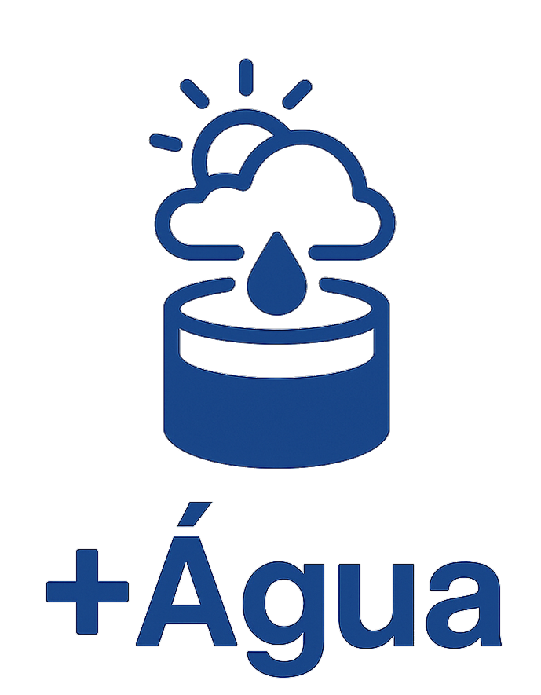

# +Água - Sistema Inteligente de Gestão Hídrica



O **+Água** é um aplicativo mobile desenvolvido em React Native Expo, integrado a uma API Java com banco de dados Oracle, que visa **implementar a gestão inteligente de reservatórios hídricos emergenciais** em ambientes sujeitos a **eventos climáticos extremos**, como enchentes e secas.

A solução conecta sensores IoT para monitoramento em tempo real, fornece painéis de visualização de dados, permite o cadastro e gestão de usuários, unidades e reservatórios, além de se integrar com APIs externas, como a OpenWeather, para alertas com base na previsão climática.

Com a intensificação de eventos extremos, o projeto surge como uma solução tecnológica para prédios residênciais para:

- Prevenir crises hídricas, causadas por eventos climáticos, com o uso da água dos reservatórios emergenciais

- Monitorar em tempo real a qualidade e o nível da água

- Automatizar processos de decisão para escoamento, captação ou restrição de consumo da água

- Conformar-se às legislações brasileiras de captação e reúso de água da chuva

Além de sua função social e ambiental, promove a segurança hídrica e otimiza os recursos

## 1. Tecnologias

- Aplicativo Mobile: Interface intuitiva para usuários como síndicos e gestores

- Backend Java: API REST que conecta o app ao banco de dados Oracle

- Banco Oracle: Armazena dados de usuários, unidades, reservatórios, histórico e notificações

- Sensores IoT: Monitoramento contínuo de nível e pH da água

- OpenWeather API: Integração para previsão climática, essencial para gestão proativa

## 2. Funcionalidades

### **Home / Dashboard**

- Ícone para trocar o repositório atual
- Ícone para cadastrar novo reservatório
- Ícone para editar o repositório atual
- Ícone para excluir o repositório atual

- Visualização do nível atual do reservatório.
- Exibição do status do pH com interpretação.
- Gráfico de barras: Evolução do nível nos últimos 7 dias.
- Gráfico de pizza: Distribuição de status do histórico do reservatório
- Previsão climática: Chance de chuva com integração à OpenWeather.

### **Login** e **Autenticação**
- Autenticação via token JWT.
- Armazenamento seguro do token com AsyncStorage.
- Logout limpa o token e desconecta o usuário.

Navegação condicional: se o usuário não possuir reservatório, orienta o cadastro.

### Cadastro Multietapas
- **Usuário:** Dados pessoais e de acesso.
- **Unidade:** Nome, capacidade e quantidade de apartamentos.
- **Endereço:** Logradouro, CEP, cidade, estado e país.

Todas as informações são enviadas ao final do processo, garantindo integridade das relações no banco de dados.

### Perfil do Síndico

- Visualização dos dados do usuário: nome, e-mail.
- Dados da unidade: endereço e quantidade de reservatórios.

### Notificações

- Listagem de notificações com paginação.
- Cada notificação contém a mensagem e a data que foi enviada.

### Gestão de Reservatórios
- Cadastro, visualização, edição e remoção.
- Todas as operações realizadas via requisições fetch para a API Java.

## 3. Como rodar o projeto

1. Clone este repositório:

```bash
git clone https://github.com/Laura-Cintra/gs-mobile.git
cd gs-mobile
```

2. Instale as dependências:

```bash
npm install
```

3. Inicie o projeto com Expo:

```bash
npm start
```

ou

```bash
npx expo start --tunnel
```

4. Escaneie o QR Code com o app Expo Go no seu celular

## 4. Integrantes

    RM: 558843 Laura de Oliveira Cintra
    RM: 558832 Maria Eduarda Alves da Paixão
    RM: 554456 Vinícius Saes de Souza
